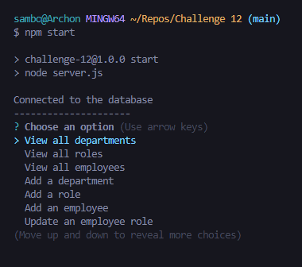
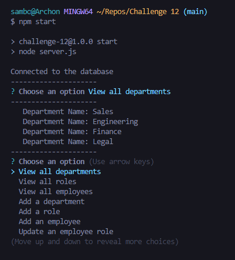
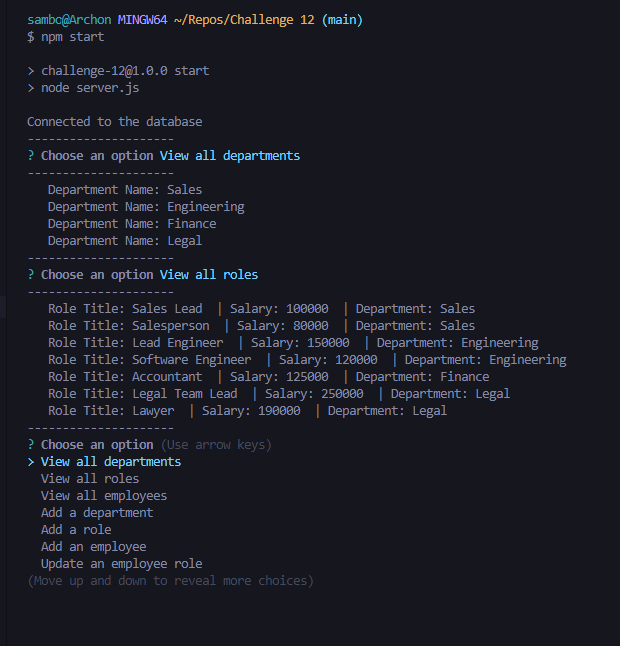

# Employee Database

This command line application can keep track of a buisiness' Department management, Role management and Employee management.

Live URL:

## Installation

1. Create a new database called "management" in mysql shell.
2. Use "management" database.
3. Source the schema.sql file in db folder.
4. Source the seed.sql file in db folder. (If you want to start with data)
5. Run the server.js file by typing "npm start" in the console.
6. use any of the menu options and follow the prompts.

## Screenshots of some of the functionalities:

## 

## 

All of the code was written by Sam Ebadi Sobi.
